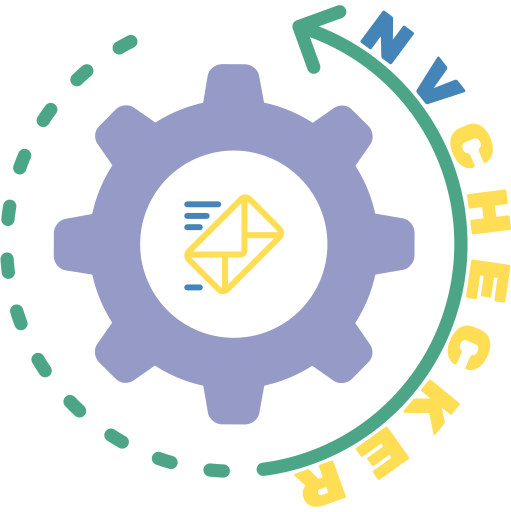

[](https://github.com/lapicidae/nvchecker-email)

new version checker (nvchecker) checks whether a new version of a software has been released and then notifies you by e-mail.


# [lapicidae/nvchecker-email](https://github.com/lapicidae/nvchecker-email)

[](https://github.com/lapicidae/nvchecker-email)
[](https://hub.docker.com/r/lapicidae/nvchecker-email)
[](https://hub.docker.com/r/lapicidae/nvchecker-email)
[](https://github.com/lapicidae/nvchecker-email/actions/workflows/docker.yml)


The nvchecker e-mail Docker image is based on [Alpine Linux](https://alpinelinux.org/), [cron](https://en.wikipedia.org/wiki/Cron) and [nvchecker](https://github.com/lilydjwg/nvchecker).


## Features

* regular and timely application updates
* [BusyBox](https://www.busybox.net/) provides a subset of over two hundred utilities
* schedule via cronjob
* simple configuration

### *Note*
The image is automatically rebuilt when the [alpine (latest)](https://hub.docker.com/_/alpine) Official Docker Image receives an update.


## Getting Started

### Usage
Here are some example snippets to help you get started creating a container.

#### *docker-compose (recommended)*

Compatible with docker-compose v2 schemas.
```yaml
version: "2.1"
services:
  nvchecker-email:
    image: lapicidae/nvchecker-email
    container_name: nvchecker-email
    environment:
      - TZ=Europe/London
    volumes:
      - /path/to/config:/nvchecker
    restart: unless-stopped
```

#### *docker cli*

```bash
docker run -d \
  --name=nvchecker-email \
  -e TZ=Europe/London \
  -v /path/to/config:/nvchecker \
  --restart unless-stopped \
  lapicidae/nvchecker-email
```

### Parameters

Container images are configured using parameters passed at runtime.

| Parameter | Default | Function |
|-----|-----|-----|
| `-e PUID=1000` | 1000 | for UserID - see below for explanation |
| `-e PGID=1000` | 1000 | for GroupID - see below for explanation |
| `-e TZ=Europe/London` | UTC | Specify a [timezone](https://en.wikipedia.org/wiki/List_of_tz_database_time_zones#List) to use (e.g. Europe/London) |
| `-e NVCHECKER_UPDATE=false` | true | Mark all versions as updated after successfully sending the e-mail (nvtake --all) |
| `-e CRON_SCHEDULE='0 6 * * *'` | '0 1 * * *' | crontab schedule ([examples](https://crontab.guru/)) |
| `-e APK_ADD=’7zip,curl,httpie’` | --- | **Comma-separated** list of additional [packages](https://pkgs.alpinelinux.org/) to be installed  |
| `-e CRON_HUMAN=false` | true | deactivate the human-readable output of the crontab schedule at the beginning of the log |
| `-v /nvchecker` | | Configuration files directory |

### User / Group Identifiers
When using volumes (`-v` flags) permissions issues can arise between the host OS and the container, we avoid this issue by allowing you to specify the user `PUID` and group `PGID`.

Ensure any volume directories on the host are owned by the same user you specify and any permissions issues will vanish like magic.

In this instance `PUID=1234` and `PGID=4321`, to find yours use `id user` as below:

```bash
  $ id username
    uid=1234(dockeruser) gid=4321(dockergroup) groups=4321(dockergroup)
```

## Configuration
Please read the [documentation](https://nvchecker.readthedocs.io/) for nvchecker.

## Note
Take a look at [crontab guru](https://crontab.guru/) for help with for cron schedule expression.

